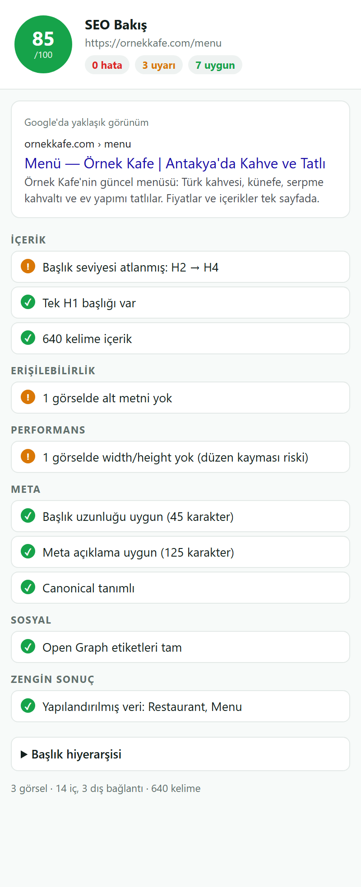

# SEO Bakış — Chrome Eklentisi

[](https://github.com/ilkertokat/seo-bakis/actions)


**Açık olan sayfanın SEO durumunu tek tıkla gösteren, bağımlılıksız bir Chrome eklentisi.** Sayfayı 100 üzerinden puanlar, Google'daki yaklaşık görünümünü çizer ve sorunları önem sırasına göre gruplar. Müşteri sitelerini teslim etmeden önce hızlı bir kontrol için yazıldı.

> *English summary below.*



## Ne kontrol ediyor?

| Grup | Kontroller |
|---|---|
| **Meta** | `<title>` uzunluğu (30–60, Türkçe karakterler doğru sayılır), meta açıklama (70–160), canonical, `robots: noindex`, `<html lang>` |
| **Mobil** | viewport meta etiketi |
| **İçerik** | Tek H1, atlanan başlık seviyeleri (H2 → H4), kelime sayısı |
| **Erişilebilirlik** | `alt` özniteliği olmayan görseller (boş `alt=""` dekoratif görseller için geçerli sayılır) |
| **Performans** | `width` / `height` belirtilmemiş görseller (düzen kayması, CLS riski) |
| **Sosyal** | Open Graph: `og:title`, `og:description`, `og:image` |
| **Zengin sonuç** | JSON-LD yapılandırılmış veri türleri (`@graph` dizileri dahil) |
| **Bağlantılar / Güvenlik** | İç ve dış bağlantı sayısı, `nofollow`, HTTPS |

Ayrıca başlık hiyerarşisini girintili bir ağaç olarak gösterir.

## Mimari

```
manifest.json      # Manifest V3 · izinler: yalnızca activeTab + scripting
popup.html/.css/.js
src/
├── collect.js     # aktif sekmede çalışır, sayfadan serileştirilebilir veri toplar
├── analyze.js     # saf değerlendirme fonksiyonu → { checks, score }
└── sample.js      # testler ve demo modu için örnek sayfa verisi
test/analyze.test.js
```

- **En az izin:** `activeTab` sayesinde eklenti yalnızca kullanıcı simgeye tıkladığında ve yalnızca o sekmeye erişir; hiçbir veri dışarı gönderilmez.
- **Toplama ve değerlendirme ayrı:** `collect()` DOM'dan ham veriyi çıkarır, `analyze()` saf bir fonksiyondur. Değerlendirme mantığı tarayıcı olmadan `node:test` ile test edilir.
- **Bağımlılık ve derleme yok:** Doğrudan ES modülleri; klasör olduğu gibi Chrome'a yüklenir.
- `popup.html?demo` adresi örnek veriyle çalışır; arayüz eklenti kurmadan geliştirilebilir.

## Kurulum

1. `chrome://extensions` → sağ üstten **Geliştirici modu**'nu açın.
2. **Paketlenmemiş öğe yükle** → bu klasörü seçin.
3. Herhangi bir sayfada araç çubuğundaki **SEO Bakış** simgesine tıklayın.

```bash
npm test        # 6 test
npm run zip     # Chrome Web Mağazası için seo-bakis.zip (Windows)
```

---

## English

**SEO Bakış** ("SEO glance") is a zero-dependency Manifest V3 Chrome extension that audits the current page in one click: title and meta description length (Unicode-aware), canonical, robots, lang, viewport, heading hierarchy and skipped levels, missing `alt` and image dimensions, Open Graph tags, JSON-LD types and link counts. It scores the page out of 100, renders an approximate Google snippet and groups issues by severity. Collection (`collect.js`, runs in the tab) is separated from evaluation (`analyze.js`, a pure function covered by `node:test`), and it requests only the `activeTab` and `scripting` permissions.

## Lisans

MIT © 2026 İlker Tokat
